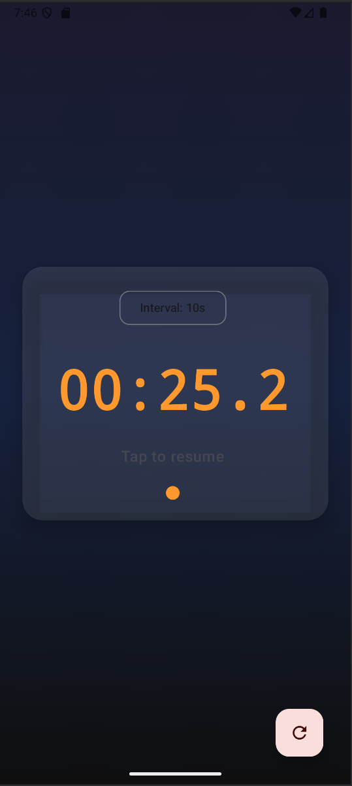

# SimpleStopWatch

A vibe coded Android stopwatch application. Just for my personal use, free of ads because there
are so many stopwatch apps but I really do not feel like paying or watching ads while using
it. Built with AI: Jetpack Compose and Material 3 design principles.

## AI used

Grok for the specification: see prompt.txt for all prompts to grok.
Cursor (Pro) to execute the steps.

## Screenshots

The app features a clean, minimalist design with:
- Large centered time display
- Status text below the timer
- Small circular indicator showing current state
- Reset button at the bottom with Material 3 styling

## Features

- **Simple Interface**: Large, easy-to-read time display with intuitive tap-to-control functionality
- **Precise Timing**: Accurate stopwatch with 1-second precision using coroutines
- **State Persistence**: Timer state persists through device rotation and configuration changes
- **Material 3 Design**: Modern UI following Material Design 3 guidelines with dark theme support
- **Visual Indicators**: Color-coded status indicator showing running, paused, or stopped states
- **Smart Controls**:
  - Tap the time display to start/pause/resume
  - Dedicated reset button with refresh icon
  - Clear status messages ("Tap to start", "Tap to pause", "Tap to resume")

## Technical Details

- **Language**: Kotlin
- **UI Framework**: Jetpack Compose
- **Design System**: Material 3
- **Minimum SDK**: API 26 (Android 8.0)
- **Target SDK**: API 36
- **Architecture**: Single Activity with Compose UI
- **State Management**: `rememberSaveable` for configuration change handling

## Key Features

### Timer Functionality
- Start, pause, resume, and reset operations
- Accurate time tracking that handles device rotation
- Time format automatically switches between MM:ss and HH:MM:SS based on duration
- Precise timing using `LaunchedEffect` and coroutines

### User Experience
- Large, bold time display (72sp) for easy reading
- Intuitive tap-to-control interface
- Visual status indicator with color coding:
  - **Blue**: Timer is running
  - **Secondary color**: Timer is paused
  - **Gray**: Timer is stopped
- Clear status messages below the time display

### Technical Implementation
- Configuration change handling using `rememberSaveable`
- System time-based calculations for accuracy
- Proper pause/resume logic with accumulated pause time tracking
- Material 3 theming with support for light/dark modes

## Getting Started

1. Clone the repository
2. Open in Android Studio
3. Build and run on an Android device or emulator (API 26+)

## Requirements

- Android Studio Arctic Fox or later
- Android SDK 26 or higher
- Kotlin 1.8+
- Jetpack Compose

## License

This project is open source and available under the MIT License.
